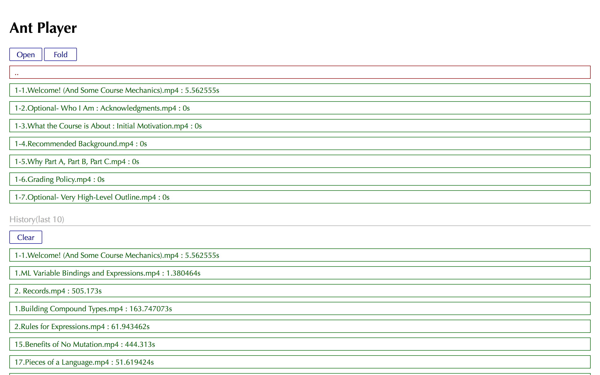
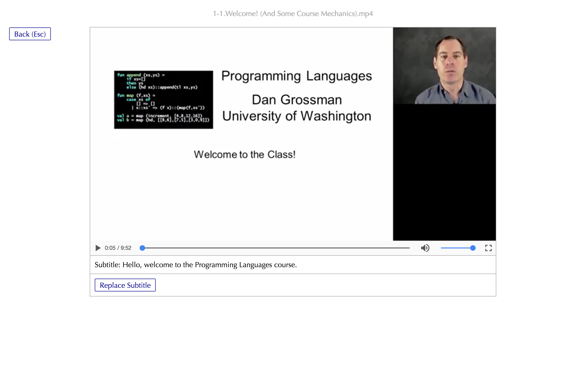

# Ant Player

最小化的一个视频播放器，支持某目录的视频文件预览和自动读取字幕文件。

开发原因是因为我经常在[Coursera](coursera.org)上学习一些课程。在线看会经常卡顿，网速不给力。所以我会先把视频文件、字幕文件下载下来本地播放。由于本地播放没有遇到什么好的播放软件（主要的问题是这些播放器无法列出一个目录下所有的视频文件，当播放某个视频时也无法自动加载同名的字幕文件），而且自己的英文还很弱，严重依赖英文字幕。

这些原因导致我想用Web技术写一个满足我要求的视频播放器。一开始我直接写一个html文件，然后用浏览器打开该页面，之后就可以选择需要播放的视频和字幕，下次进来还能记住播放的位置。但是嫌太麻烦，无法以下读取某个目录下的所有视频文件，无法自动加载同名的字幕文件。于是在改进下，使用Electron来开发，提供展示某个目录下的视频文件预览，并可以方便的进入其他目录，同时还能自动加载对于的字幕文件，假如存在的话。

## 程序界面截图

## 以后功能

- 预览目录下的所有视频文件，点击可进行播放，并自动读入同名的字幕文件(后缀名为.vtt)
- 使用localStorage记录视频播放的位置
- 根据播放的时间显示对应的字幕，可点击某个单词查询意思

## 待开发功能

- 播放视频界面提供字幕选择按钮

## 安装

生成应用程序之前先 `npm install` 安装依赖。

### 生成Mac程序

`npm run build-mac`

运行完之后将在`Ant Player-darwin-x64`目录下得到`Ant Player.app`程序文件，拷贝到Mac的应用程序目录下即可。

### 生成Linux程序

正在推出...

### 生成Windows程序

正在推出...

## 许可证

[MIT](LICENSE)
